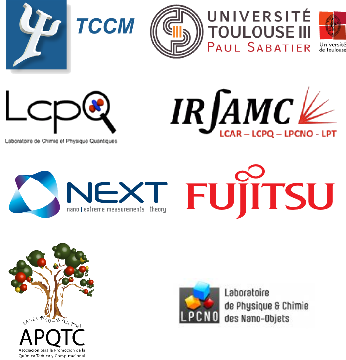

The **9th edition** of the [Intensive Course of the European Master in
Theoretical Chemistry and Computational Modelling
(TCCM)](http://www.emtccm.org/tccm-em/) will be organized at the Université
Paul Sabatier (*IRSAMC building*) in Toulouse - France, and held from the **1st to 26th September**.

This intensive course is part of the program of studies of the European Master
TCCM, and primarily organized for the students from the 25 participating
institutions in Europe.

## Organising committee

### Teachers of the Université Paul Sabatier
* Stefano Evangelisti
* Thierry Leininger
* Romuald Poteau

### European project engineer
* Aude Garsès

### PhD students
* Muammar El Khatib
* Oriana Brea
* Juan Sanz
* Vijay Chilkuri
* Christoph Iftner
* Lucy Cusinato

## Sponsors

